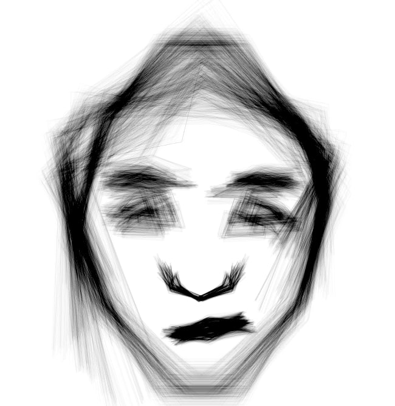

# Vermicelli
Vector hierarchical probabilistic drawing. 

## Overview
Vector: specify coordinates, not pixels.

Hierarchical: each object can be used as a reference frame for others.

Probabilistic: no need to specify everything exactly, distribution is enough.

Pyro is used to compute log-probabilities given the configuration of coordinates. But the inference itself runs Adam (for quick convergence close to the optimum) + Metropollis-Hastings (for randomness), because when I tried using Pyro's MCMC it had very low acceptance rates and therefore slow convergence.

## Usage
Put your code into `vermicelly.py`. Running it will compile your code into Python + Pyro and inject it into `prob.py`, which is just a template. The result is `a.py`, which actually runs the rendering (= inference).

Code for a simple model:
```python
// anchors
OX_len ~ N(90.0, 1.0)
X := -OX_len * v(0, 1)
M ~ N(v(10, 55), v(2, 3))

// nose
n1 ~ N(v(0, 20), v(5, 5))
n2 ~ N(v(40, 0), v(4, 4))
n2s := MIRROR_X @ n2
n3 ~ N(v(30, -20), v(4, 4))
n3s := MIRROR_X @ n3

// lips
Mmb ~ N(0.2 * M, v(2, 2))
Mma ~ N(0.8 * PERP_LEFT @ M, v(5, 5))
ma := M + Mma
mas := M - Mma
mb := M + Mmb
mbs := M - Mmb
```
Other details you can find and/or modify directly in the code.

## Gallery



